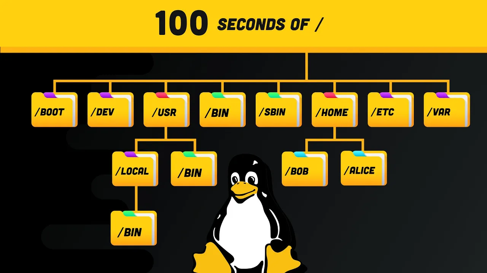
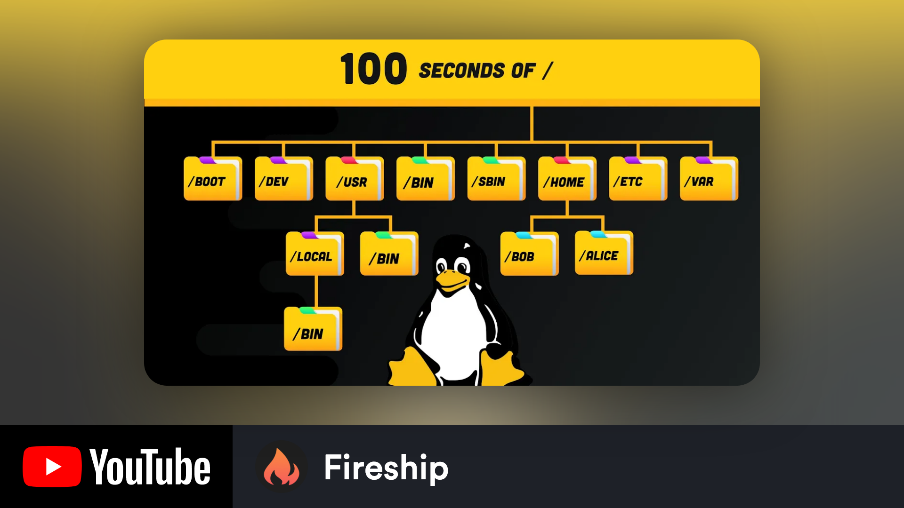
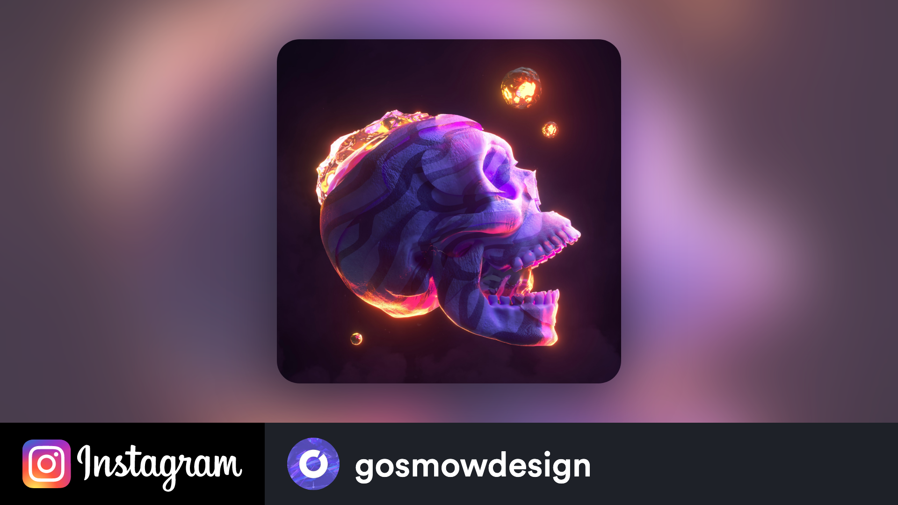
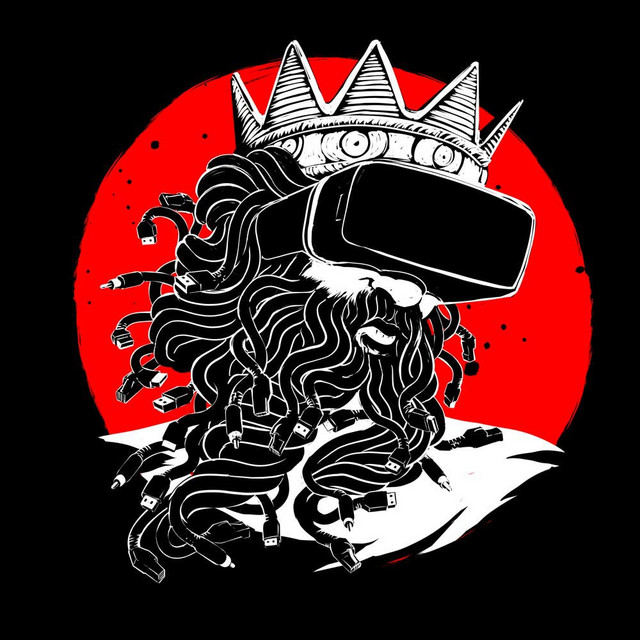
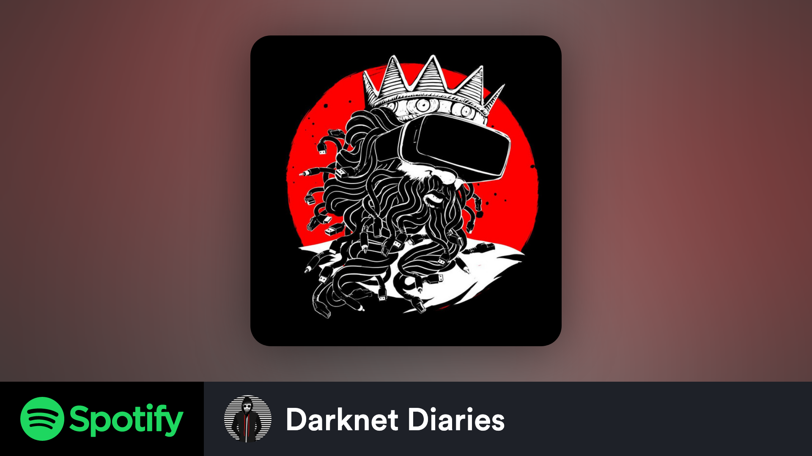

<div align="center">

[](https://github.com/matthewnau/botross)
  
[](#release-files "Release")
[](LICENSE "License")
[](https://github.com/matthewnau/botross/wiki "Wiki")

</div>

## About

<!-- <Main description> -->
BotRoss is a Python based image rendering tool that uses HTML-defined templates and the [html2image](https://github.com/vgalin/html2image) package to generate dynamic thumbnails. The main purpose of BotRoss is to help video preservationists better organize and display their content, while also making it possible for creators to automate a step in their workflow.

> BotRoss helps to bridge the gap between Aesthetics and Organization.

Designing a visual schema that elegantly represents content from a wide variety of sources often isn't anyone's top priority. But not having a design schema can make it a hassle even when searching through vast amounts of organized content.

BotRoss addresses this problem by enabling users to easily render dynamic thumbnails that display additional metadata. It can be easily implemented in post-processing pipelines, run as a command line program, or be integrated into your own applications.

Instantly upgrade your archive with the default template, or create your own! BotRoss is extremely flexible and enables you to represent your content however you would like.

For a more detailed introduction to BotRoss, check out the [beginner's guide]() in the Wiki.

## Installation
BotRoss is published on PyPI and can be installed through pip. 
```console
pip install botross
```

## Examples

The following are some render examples that used BotRoss' `default` template. The `input-image`, `output-image`, and command structure are all shown for each example provided.

### Example 1 - YouTube Video

#### Input:
>  Original thumbnail - scraped from [this](https://www.youtube.com/watch?v=42iQKuQodW4) video created by *Fireship*.

#### Output:
>  Generated thumbnail

#### Command:
```console
botross -i image1.png -p fireship.jpg -pf youtube -u Fireship
```

### Example 2 - Instagram Video

#### Input:
> <div align="center"></div>
> Original thumbnail - scraped from <a href="https://www.instagram.com/p/COA9b3oiaBo/">this</a> video created by <i>gosmowdesign</i>

#### Output:
>  Generated thumbnail

#### Command:
```console
botross -i image2.png -p gosmowdesign.jpg -pf instagram -u gosmowdesign
```

### Example 3 - Spotify Podcast

#### Input:
> <div align="center"></div>
> Original thumbnail - scraped from <a href="https://open.spotify.com/episode/0yyrgf9x4x8BB7i8VENFbF/">this</a> podcast created by <i>Jack Rhysider</i>

#### Output:
>  Generated thumbnail

#### Command:
```console
botross -i image3.png -p "Jack Rhysider.jpeg" -pf spotify -u "Darknet Diaries"
```